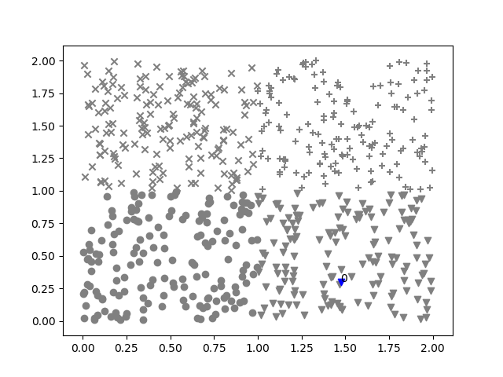
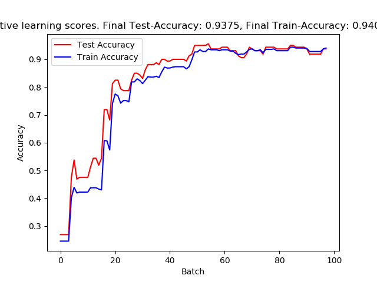
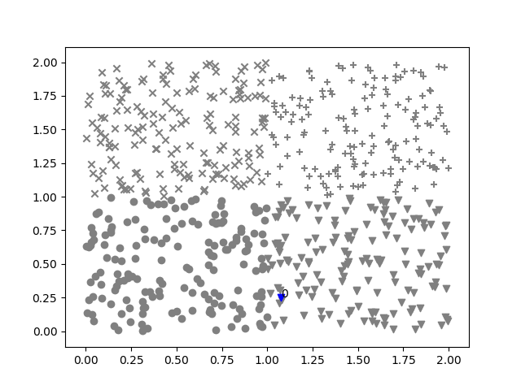
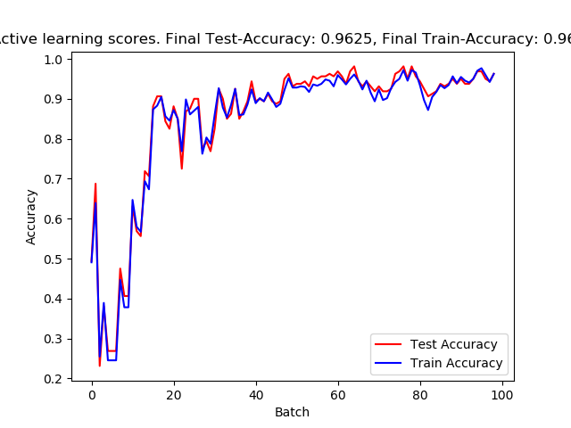
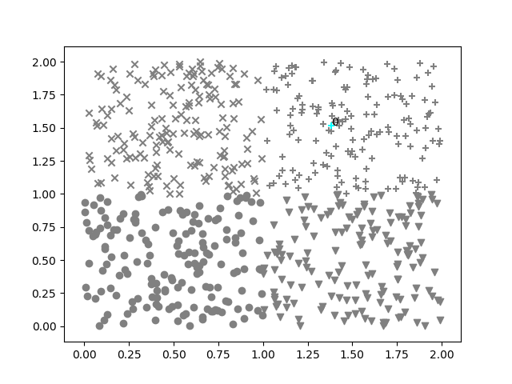
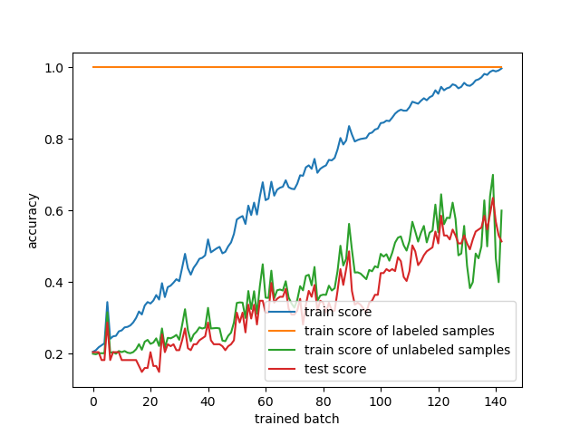

# ALeFra - Active Learning Framework

## Features
- Convert any classifier (online and offline) in an active trainable classifier
- Make active training easy by a single loop
- Select from a couple of querying methods or write your own with ease
- Visualize the training procedure with a feature embedding (t-SNE or MDS)
- Score a test set
- If training images, visualize them by create nice collage images throughout training (of queried samples, new correct/false samples and samples which label did changed in the last batch)

## Installation
```sh
$ git clone https://github.com/limchr/ALeFra
$ cd ALeFra/
$ python3 ./setup.py install
```
Alternatively you can just copy the active_classifier.py and active_strategies.py in your project folder.

## Documentation
Documentation can be found [here](https://htmlpreview.github.io/?https://github.com/limchr/ALeFra/blob/master/active_classifier.m.html). 

## Example usage
Full example files are under the [examples sub-directory](https://github.com/limchr/ALeFra/tree/master/examples).

### Load some data

```python
import numpy as np
from sklearn.model_selection import train_test_split
from sklearn.svm import SVC

# import the main functionality of ALeFra
from ALeFra.active_classifier import active_classifier
# import some predefined querying strategies
from ALeFra.active_strategies import strategy_query_random, strategy_query_least_confident

def load_toy_4(n,overlap):
    """creates a toy data set with 4 classes and a specific overlap"""
    cl1_x = np.array([np.random.random(n), np.random.random(n)]).T
    cl1_y = np.array([0] * n)
    cl2_x = np.array([np.random.random(n)+(1-overlap), np.random.random(n)]).T
    cl2_y = np.array([1] * n)
    cl3_x = np.array([np.random.random(n), np.random.random(n)+(1-overlap)]).T
    cl3_y = np.array([2] * n)
    cl4_x = np.array([np.random.random(n)+(1-overlap), np.random.random(n)+(1-overlap)]).T
    cl4_y = np.array([3] * n)
    x = np.vstack((cl1_x, cl2_x,cl3_x,cl4_x))
    y = np.hstack((cl1_y,cl2_y,cl3_y,cl4_y))
    return (x,y)

# load data set
x, y = load_toy_4(200,0)
# doing a train/test split
x_train, x_test, y_train, y_test = train_test_split(x, y, test_size=0.2, random_state=42)
``` 
First we load some data to train our classifier with and split them into a train/test set.

### Define active classifier

```python
# export dir for saving plots
EXPORT_DIR = 'export'
# to do uncertainty sampling we need certainty information from the SVM (SVC scikit-learn classifier)
svm_kwargs = {'probability':True}

#convert scikit-learn SVC classifier to an active classifier using ALeFra
active_cls = active_classifier(classifier=SVC,  # support vector classifier from scikit-learn
                               score_method=None,  # using zero-one-loss as default loss function for plots
                               x = x_train,
                               y = y_train,
                               # True if using an online/incremental trainable classifier,
                               # otherwise the classifier is trained from scratch after each batch
                               incremtenal_trainable=False,
                               classifier_args=(),
                               classifier_kwargs=svm_kwargs,  # Pass keyword arguments for the SVC classifier
        )


# set strategy for querying
active_cls.set_query_strategy(strategy_query_random)

#set test set
active_cls.init_log(EXPORT_DIR,visualization_method='tsne',x_test = x_test,y_test = y_test,img_test = None)
```

Define the actual classifier. In this example we just use the SVM from scikit-learn as a base classifier. Since it is only trainable offline, it is retrained from scratch after each trained batch. For uncertainty sampling we also need to pass the probability argument to the initialization of SVC. We can pass a list with parameters or in this case a dict with keyword-parameters to the constructor of active_classifier.
Also we define the querying strategy to a random querying, and we also set the test-set with init_log.

### Training and logging
```python
#active querying and testing/logging
for epoch in range(100):
    print(epoch)
    active_cls.fit_active(1)  # query batch of size 1 and train it
    active_cls.evaluate()  # evaluate test and train set
    active_cls.visualize_by_embedding()  # visualize training progress using a t-SNE embedding (saved in export dir)


# save a plot of scores while training
active_cls.save_scores_plot()
```

The training is done with a single loop. To train the classifier fit_active has to be called with a batch_size parameter. To evaluate the test and train set call to evaluate() method is neccessary. With the visualize_by_embedding method, an embedding (like t-SNE or MDS) is calculated if the feature space dimensionality is greater than 2, to display the progress and especially the querying while training. With a call to save_scores_plot() an accuracy plot while training is created. All logs are saved in the export directory. 

### Output


As you can see, the samples are queried randomly.



In the score plot the evaluation of the complete train_x and test_x is displayed (not only the labeled pool). 

### Change querying strategy
```python
# set strategy for querying
active_cls.set_query_strategy(strategy_query_least_confident)
```
We change the sampling method with above line to uncertainty based sampling. There we predict the certainty of every sample in the unlabeled pool and select the samples with the least certainty for querying.



As you can see, the samples near the decision boundaries are queried with this sampling method. 



In the score plot you can see, that x_train and x_test is converging more than in random sampling. Also the accuracy is increasing faster compared to random sampling.

### Create an own fancy sampling technique
It is easy to create a querying method and use it with ALeFra.

```python
def strategy_query_lower_percentile_randomly(obj,batch_size,lower_percentile_size=0.2):
    """active querying which queries a random subset of the x% percentile of least confident samples"""
    # try to predict the accuracy of the unlabeled set for uncertainty sampling
    try:
        pred = obj.exec_cls_fun(obj.predict_proba_,obj.get_unlabeled_x())
    # if it is not possible (because e.g. the classifier was not trained yet), then do a random sampling
    except:
        print('can not predict probability: query randomly')
        return strategy_query_random(obj,batch_size)
    # we only want the maximum class probability of all samples
    pred = helper.convert_probas_to_max_cls_proba(pred)
    if np.array(pred).all() == 0:
        print('can not predict probabilities, it seems there was something wrong: query randomly')
        inds = np.random.choice(len(pred), batch_size)
    else:
        percentile_size = int(max(len(pred)*lower_percentile_size,batch_size))
        inds = np.argsort(pred)[:percentile_size]
        try:
            inds = np.random.choice(inds, batch_size, replace=False)
        except Exception:
            return []
    return inds

...

# set strategy for querying
active_cls.set_query_strategy(strategy_query_lower_percentile_randomly, lower_percentile_size=0.2)

```

Basically you only need to create a function where obj (the active_classifier instance), batch_size and other variables you like to use, are passed. With obj you can access all variables of the class (take a look in the documentation). Especially obj.cls, the classifier instance, is important. You can also call methods directly from the classifier using obj.cls.predict_proba(obj.get_unlabeled_x()) or you can use (as mentioned above) the callback functions you passed to the constructer of active_classifier for a more versatile and classifier independent way.




As you can see our new querying method relaxes the constraines of the former uncertainty-based sampling a bit and also takes samples into account that are quite uncertain but not directly on the decision boundary. This can help to prevent e.g. querying from stuck into one place at feature space.


### Create custom visualization plots
The whole training progress is saved in the active_classifier object, so you can easily create custom plots like with:

```python
# alternatively a score plot can be calculated manually
train_scores, train_scores_labeled, train_scores_unlabeled = active_cls.get_train_scores()
test_scores = active_cls.get_test_scores()
plt.clf()
plt.ion()
plt.plot(train_scores,label='train score')
plt.plot(train_scores_labeled,label='train score of labeled samples')
plt.plot(train_scores_unlabeled,label='train score of unlabeled samples')
plt.plot(test_scores,label='test score')
plt.legend()
plt.xlabel('trained batch')
plt.ylabel('accuracy')
plt.ioff()
plt.show()

```

This produces an accuracy plot with the labeled and unlabeled pool (and combined) of the train set and also the test accuracy. Digits example:



### Visualizing image data
A big focus of our own work is training active learning methods on image data. If images are passed to the init_log method and the constructor, ALeFra creates collage images after each batch. In this collage images, the queryied samples are visualized and also the (in that particular batch) new right or wrong classified samples and the samples which label did changed. Take a look at the example test_digits


### Train until empty unlabeled pool
If the training should be continued until the unlabeled pool is empty this can be done:

```python
#active querying and testing/logging
while True:
    r = active_cls.fit_active(5)
    if r is not False and len(active_cls.unlabeled_i_) != 0:
        active_cls.evaluate(score_train_set=True, log_collage_image=True, log_single_images=True)
        active_cls.visualize_by_embedding()
    else:
        break
```

## Literature
[Christian Limberg, Heiko Wersing, Helge Ritter (2018) 
Efficient Accuracy Estimation for Instance-Based Incremental Active Learning 
European Symposium on Artificial Neural Networks (ESANN)](http://www.honda-ri.de/pubs/pdf/2125.pdf)

## License
Copyright (C) 2018
Christian Limberg
Centre of Excellence Cognitive Interaction Technology (CITEC)
Bielefeld University


Redistribution and use in source and binary forms, with or without modification,
are permitted provided that the following conditions are met:

1. Redistributions of source code must retain the above copyright notice,
this list of conditions and the following disclaimer.

2. Redistributions in binary form must reproduce the above copyright notice, this list of conditions
and the following disclaimer in the documentation and/or other materials provided with the distribution.

3. Neither the name of the copyright holder nor the names of its contributors may be used to endorse or promote
products derived from this software without specific prior written permission.

THIS SOFTWARE IS PROVIDED BY THE COPYRIGHT HOLDERS AND CONTRIBUTORS "AS IS" AND ANY EXPRESS OR IMPLIED WARRANTIES, INCLUDING, BUT NOT LIMITED TO, THE IMPLIED WARRANTIES OF MERCHANTABILITY AND FITNESS FOR A PARTICULAR PURPOSE ARE DISCLAIMED. IN NO EVENT SHALL THE COPYRIGHT HOLDER OR CONTRIBUTORS BE LIABLE FOR ANY DIRECT, INDIRECT, INCIDENTAL, SPECIAL, EXEMPLARY, OR CONSEQUENTIAL DAMAGES (INCLUDING, BUT NOT LIMITED TO, PROCUREMENT OF SUBSTITUTE GOODS OR SERVICES; LOSS OF USE, DATA, OR PROFITS; OR BUSINESS INTERRUPTION) HOWEVER CAUSED AND ON ANY THEORY OF LIABILITY, WHETHER IN CONTRACT, STRICT LIABILITY, OR TORT (INCLUDING NEGLIGENCE OR OTHERWISE) ARISING IN ANY WAY OUT OF THE USE OF THIS SOFTWARE, EVEN IF ADVISED OF THE POSSIBILITY OF SUCH DAMAGE.
